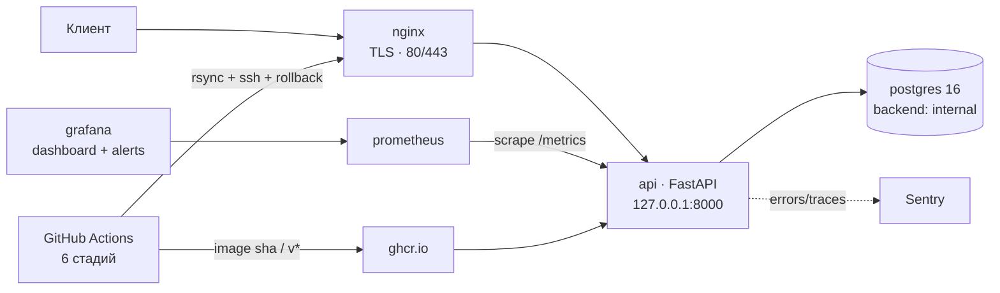
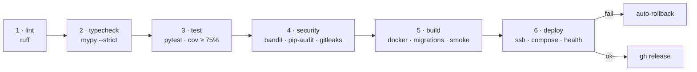

# OrderFlow Platform

[](https://github.com/AlexGoster/orderflow-platform/actions/workflows/ci.yml)
[](security/SECURITY.md)
[](#тесты-и-гейты)
[](#тесты-и-гейты)
[](https://www.python.org/)
[](LICENSE)

Production-grade CI/CD, безопасность и наблюдаемость для экосистемы OrderFlow.

Проект — эталон того, как сервис доводится до прода: шестистадийный пайплайн с
гейтами, статический и секрет-анализ, деплой по SSH с автоматическим откатом,
Prometheus + Grafana с SLO и алертами, runbook дежурного и модель угроз STRIDE.
Демо-сервис — FastAPI CRUD для feature flags — нужен как *настоящий* артефакт,
который действительно собирается, тестируется, падает и откатывается.

- Архитектура и решения — [`docs/ARCHITECTURE.md`](docs/ARCHITECTURE.md)
- SLO, бюджет ошибок — [`docs/SLO.md`](docs/SLO.md)
- Runbook дежурного — [`docs/RUNBOOK.md`](docs/RUNBOOK.md)
- Модель угроз и disclosure — [`security/SECURITY.md`](security/SECURITY.md)

---

## Что внутри

- **CI/CD из 6 стадий** — lint → typecheck → test → security → build → deploy, каждая с чётким условием падения и `needs:`-цепочкой.
- **Гейты качества** — `ruff` (lint+format), `mypy --strict`, покрытие ≥ 75%, `bandit`, `pip-audit --strict`, `gitleaks`.
- **Безопасность** — свой gitleaks-конфиг в репо, non-root контейнеры, `read_only` + `no-new-privileges`, `internal`-сеть для БД, `.env` вне git.
- **Наблюдаемость** — метрики из приложения, 3 алерта (Prometheus + Grafana), дашборд на 8 панелей, JSON-логи с `request_id`, Sentry.
- **Деплой** — `rsync` конфигов, `alembic upgrade head`, health-чек, **автоматический rollback** при провале; ручной откат — одна команда.
- **Эксплуатация** — runbook по каждому алерту, бэкап/restore PostgreSQL, чеклист постмортема.

---

## Архитектура



Подробно: [`docs/ARCHITECTURE.md`](docs/ARCHITECTURE.md).

---

## Быстрый старт

Три команды — сервис поднимается локально (нужен Python 3.11+):

```bash
pip install . -r requirements-dev.txt
python -m alembic upgrade head
python -m uvicorn app.main:app --reload
```

```bash
curl http://127.0.0.1:8000/health      # {"status":"ok"}
curl http://127.0.0.1:8000/ready       # {"status":"ready","checks":{"database":"up"}}
curl http://127.0.0.1:8000/metrics     # http_requests_total...
curl http://127.0.0.1:8000/docs        # Swagger
```

Переменные окружения — в `.env.example` (скопируйте в `.env`). Для прод-стека:

```bash
docker compose -f infra/docker-compose.prod.yml up -d
```

---

## Структура репозитория

```
orderflow-platform/
├── app/                     # FastAPI: core/ (config, logging, db, middleware, sentry),
│                            #   api/routes (health, flags), services/
├── alembic/                 # миграции (expand/contract)
├── tests/                   # 40 тестов, покрытие 100%
├── .github/workflows/       # ci.yml (6 стадий), release.yml; dependabot.yml
├── deploy/                  # deploy.sh, rollback.sh, lib.sh, site.yml (ansible)
├── infra/                   # Dockerfile, docker-compose.prod.yml, nginx/
├── observability/           # prometheus/, grafana/ (данные, provisioning, alerts)
├── security/                # .gitleaks.toml, SECURITY.md
├── scripts/                 # check_configs.py (валидация конфигов), smoke_check.py
└── docs/                    # ARCHITECTURE, SLO, RUNBOOK
```

---

## CI/CD: шесть стадий



| Стадия | Команда-гейт | Падает, если |
|--------|--------------|--------------|
| 1 lint | `ruff check .` + `ruff format --check .` | любой линтер/формат |
| 2 typecheck | `mypy app` | хоть одна ошибка типов (`strict`) |
| 3 test | `pytest --cov=app --cov-fail-under=75` | упали тесты или покрытие < 75% |
| 4 security | `bandit -c pyproject.toml -r app` · `pip-audit --strict` · `gitleaks` | high-находка / известный CVE / секрет |
| 5 build | `docker build` → `alembic upgrade head` → `/health`, `/ready`, `/metrics` | образ не собрался или не отвечает |
| 6 deploy | `bash ./deploy/deploy.sh` | health-чек на проде не прошёл → откат |

Стадии 1–4 идут на `pull_request`; 5–6 — только на `push` в `main` и на теги `v*`.

---

## Как проходит релиз

1. PR → стадии 1–4, ревью, merge в `main`.
2. `push` в `main` → стадия 5: сборка образа с тегом `${{ github.sha }}`, накат миграций в контейнере, smoke-тест трёх эндпоинов, push в `ghcr.io`.
3. Стадия 6: `SSH_KEY`/`SSH_HOST` из secrets → `rsync` каталогов `deploy`, `infra`, `observability` → `docker compose pull` → `compose run --rm migrate` → `compose up -d`.
4. `wait_healthy` опрашивает `https://orderflow.example.com/health`.
5. **Успех** → в `.release-version` пишется тег, `compose ps`, job зелёный.
6. **Провал** → логи `api`, вызов `rollback.sh` на предыдущий тег из `.release-previous`, job красный.
7. Тег `v*` дополнительно повторяет build+deploy и создаёт GitHub Release с автогенерированными notes.

Ручной откат в любой момент:

```bash
SSH_HOST=<host> TARGET_TAG=<предыдущий_тег> bash deploy/rollback.sh
```

---

## Безопасность

| Контрол | Реализация |
|---------|-----------|
| Секреты в git | `gitleaks` + `security/.gitleaks.toml` (свои 3 правила поверх 180+ дефолтных), `GITLEAKS_CONFIG` в CI |
| Уязвимые зависимости | `pip-audit --strict`, Dependabot для `pip` и `github-actions` |
| Уязвимый код | `bandit -c pyproject.toml -r app`, `mypy --strict` |
| Контейнеры | пользователь `10001`, `read_only`, `tmpfs`, `no-new-privileges` |
| Сеть | `backend` — `internal: true`; api слушает только `127.0.0.1`; Grafana/Prometheus — localhost |
| Секреты в CI | только `secrets.SSH_HOST`, `secrets.SSH_KEY`, `vars.DEPLOY_USER` |
| Реагирование | policy + STRIDE-матрица в [`security/SECURITY.md`](security/SECURITY.md) |

Проверить всё локально перед PR:

```bash
python scripts/check_configs.py
python -m ruff check . && python -m ruff format --check .
python -m mypy app
python -m pytest --cov=app --cov-fail-under=75
python -m bandit -c pyproject.toml -r app -q
python -m pip-audit --strict
gitleaks dir . --config security/.gitleaks.toml --redact --exit-code 1
```

---

## Наблюдаемость и SLO

- **Метрики:** `http_requests_total{status,method}`, `http_request_duration_seconds` — из приложения, `/metrics`, scrape каждые 15 s.
- **Алерты:** `HighErrorRate` (5xx > 5%, 5 мин, critical), `HighP95Latency` (> 200 мс, 10 мин, warning), `ApiDown` (2 мин, critical) — продублированы в Prometheus и Grafana.
- **Дашборд:** `OrderFlow Platform — API Overview` — availability, RPS, ошибки, p50/p95/p99, `up`.
- **SLO:** доступность 99.5% (бюджет 216 мин/мес), p95 ≤ 200 мс, `up` ≥ 99.9% — с burn-rate и политикой freeze релизов в [`docs/SLO.md`](docs/SLO.md).
- **Логи и ошибки:** JSON с `request_id`, Sentry для стектрейсов; реакция — в [`docs/RUNBOOK.md`](docs/RUNBOOK.md).

---

## Тесты и гейты

```bash
python -m pytest --cov=app --cov-report=term-missing   # 40 тестов, 100% coverage
python -m ruff check .                                  # All checks passed!
python -m mypy app                                      # Success: no issues in 19 source files
python -m bandit -c pyproject.toml -r app -q            # exit 0
python scripts/check_configs.py                         # YAML/JSON/TOML + структура compose/playbook/dashboard
```

Что покрыто: liveness/readiness/metrics, middleware (request_id, логи, метрики),
CRUD флагов (happy path + валидации + 404), конфиг, обработчики исключений,
Alembic-ревизия, инициализация приложения.

---

## Roadmap

1. Аутентификация (OIDC) и RBAC для `/api/v1/*` — закрывает ограничение №1 в SECURITY.md.
2. WAF-правила и расширенный rate limiting на nginx (сейчас — базовый `limit_req` 10 r/s).
3. Canary-деплой и автоматический откат по проценту 5xx.
4. Автоматические бэкапы PostgreSQL + проверка restore.
5. Alertmanager с маршрутизацией по severity и наработкой на ложные срабатывания.
6. **Kubernetes:** Helm-чарт, HPA, NetworkPolicy, PodDisruptionBudget, GitOps через Argo CD.

---

## Связанные репозитории

| Репозиторий | Роль в экосистеме |
|-------------|-------------------|
| [orderflow-core](https://github.com/AlexGoster/orderflow-core) | доменное ядро и базовые конвенции (ruff/mypy/pytest) |
| [orderflow-jobs](https://github.com/AlexGoster/orderflow-jobs) | фоновые задачи и очереди |
| [orderflow-scale](https://github.com/AlexGoster/orderflow-scale) | инфраструктура и масштабирование |
| [orderflow-services](https://github.com/AlexGoster/orderflow-services) | интеграционные сервисы |
| **orderflow-platform** | CI/CD, безопасность, наблюдаемость, деплой |

---

## Лицензия

[MIT](LICENSE) © AlexGoster
