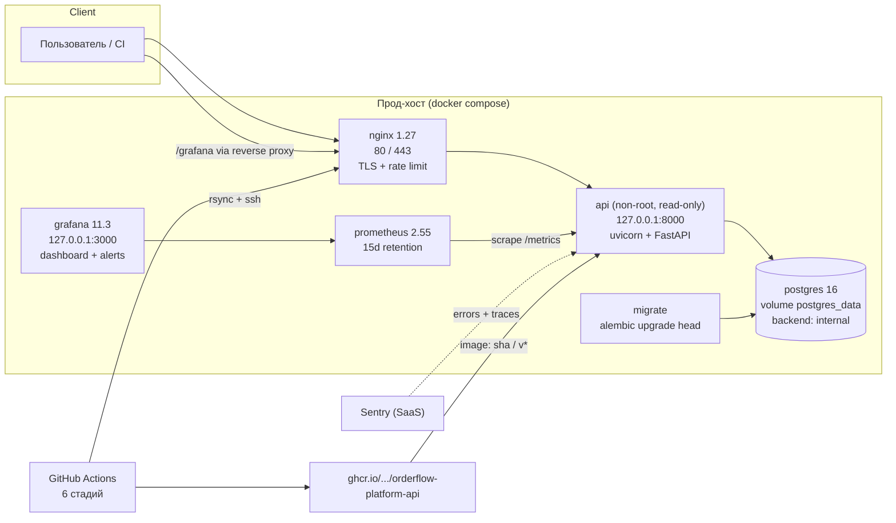
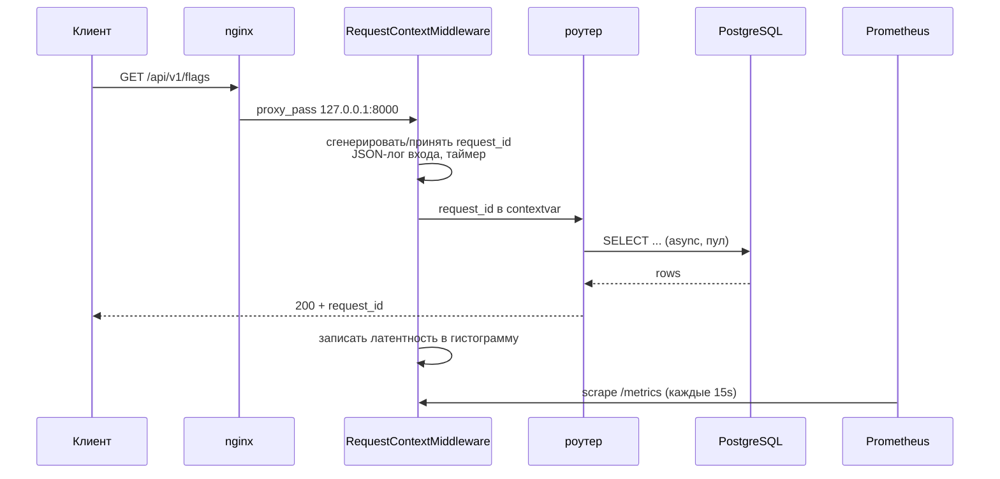
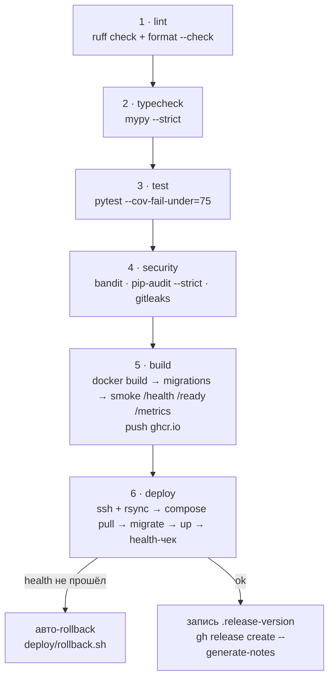

# Архитектура OrderFlow Platform

Репозиторий — производственная площадка (CI/CD, безопасность, наблюдаемость) вокруг
небольшого, но честно написанного FastAPI-сервиса. Сервис — **артефакт демонстрации**:
на нём видно, как продаётся и эксплуатируется любое другое приложение экосистемы.

---

## 1. Развёртывание (production)



Сети: `edge` (nginx, api, prometheus, grafana) и `backend` (`internal: true` —
только postgres). API опубликован исключительно на `127.0.0.1`, наружу ходит nginx.

**Три команды локально** (без Docker):

```bash
python -m venv .venv && .venv\Scripts\activate
pip install . -r requirements-dev.txt
cp .env.example .env
python -m alembic upgrade head
python -m uvicorn app.main:app --reload
```

---

## 2. Путь одного запроса



Два обязательных полюса ответа: `request_id` (чтобы найти запрос в логах и Sentry)
и корректный HTTP-код (чтобы SLI-1 считался честно).

---

## 3. Слои приложения

```
app/
├── main.py                 # create_app(): CORS → middleware → роуты → Sentry
├── metrics.py              # http_requests_total, http_request_duration_seconds
├── models.py / schemas.py  # SQLAlchemy-модель и Pydantic-схемы
├── core/
│   ├── config.py           # pydantic-settings, .env, ENVIRONMENT
│   ├── logging.py          # JSON-формат, request_id_var (contextvar)
│   ├── database.py         # async engine + session_factory + get_session
│   ├── exceptions.py       # глобальный handler: клиенту — код, в лог — детали
│   ├── middleware.py       # request_id, тайминг, метрики
│   └── sentry.py           # init_sentry: DSN, sample rate, ignore HealthCheck
├── api/
│   ├── router.py           # /api/v1
│   └── routes/
│       ├── health.py       # /health, /ready, /metrics
│       └── flags.py        # CRUD feature flags
└── services/flags.py       # бизнес-логика, работает только через сессию
```

Правило зависимостей: `routes → services → core`. Роуты не знают о SQL,
сервисы не знают о FastAPI. Это то, что проверяет `mypy --strict`.

**Разделение health/ready:**

| Эндпоинт | Проверяет | Кто вызывает |
|----------|-----------|--------------|
| `GET /health` | только процесс | Docker healthcheck, «жив ли процесс» |
| `GET /ready` | `SELECT 1` к БД, 503 при отказе | k8s readiness / балансировщик / deploy-чек |
| `GET /metrics` | ничего (но требует свежих метрик) | Prometheus, 15s |

---

## 4. CI/CD: шесть стадий



Каждая стадия — отдельный job с `needs:` предыдущей: падает первая, остальные не
тратят минуты раннера. Stages 1–4 исполняются на `pull_request`, стадии 5–6 — только
на `push` в `main` и на теги `v*`. Секреты деплоя: `secrets.SSH_HOST`,
`secrets.SSH_KEY`, `vars.DEPLOY_USER`.

Подробности релизного потока — в `README.md` («Как проходит релиз»).

---

## 5. Наблюдаемость

| Слой | Что даёт | Где лежит |
|------|----------|-----------|
| Метрики | `http_requests_total{status,method}`, `http_request_duration_seconds_bucket` | `app/metrics.py`, scrape в `prometheus.yml` |
| Правила | `HighErrorRate`, `HighP95Latency`, `ApiDown` | `prometheus/rules.yml` |
| Алерты UI | те же три правила в unified alerting | `grafana/alerts.yml` |
| Дашборд | availability, RPS, ошибки, p50/p95/p99 | `grafana/dashboard.json` |
| Логи | JSON + `request_id` + `service` + `environment` | stdout → `docker compose logs` |
| Ошибки | стектрейсы и перформанс, группировка | `app/core/sentry.py` |

SLO и математика бюджета ошибок — в `docs/SLO.md`, реакция на алерты — в
`docs/RUNBOOK.md`.

---

## 6. Ключевые решения (ADR, кратко)

| Решение | Почему | Альтернатива и когда менять |
|---------|--------|-----------------------------|
| **async SQLAlchemy 2 + asyncpg** | Один поток uvicorn держит много соединений; тесты идут на `aiosqlite` без Docker | Синхронный SQLAlchemy — при переходе на CPU-bound логику; замена на Tortoise/asyncpg-напрямую при жёстком лимите по латентности |
| **`/health` и `/ready` разделены** | Liveness не должен падать из-за БД, иначе лавинные рестарты | Слияние допустимо только в одночастичном демо |
| **SSH + rsync + compose вместо Kubernetes** | Воспроизводимо без кластера, откат за одну команду, понятно на собеседовании | k8s — когда появляется горизонтальное масштабирование (см. Roadmap) |
| **gitleaks-конфиг в репозитории** (`GITLEAKS_CONFIG`) | Правила версионируются вместе с кодом и меняются в том же PR | Глобальный org-конфиг — при росте числа репозиториев |
| **Расширение конфига `useDefault = true`** | 180+ готовых правил + свои три (`orderflow-github-token`, `orderflow-private-key`, `orderflow-database-url-with-password`) | Отключение default — только если правила конфликтуют |
| **expand/contract миграции** | `deploy.sh` не откатывает миграции: старый код обязан работать с новой схемой | Специальные down-миграции — в критических случаях, с ревью DBA |
| **Структурированные логи + contextvar** | `request_id` связывает ответ клиенту, лог контейнера и событие в Sentry | Стоковые текстовые логи — только для локальной отладки |
| **Нестандартный пользователь + `read_only`** | Меньше поверхность атаки контейнера (STRIDE, риск №6 в SECURITY.md) | Невозможно для образов, пишущих в `/usr` — тогда отдельный volume, не `root` |

---

## 7. Не входит в scope

- Аутентификация/авторизация API (roadmap), rate limiting на edge.
- Горизонтальное масштабирование, шардирование, кэш-слой.
- Автоматические бэкапы PostgreSQL (см. RUNBOOK §3 — выполняются вручную).
- Multi-region, blue-green и canary-деплой (canary — первый пункт Roadmap).

Структура репозитория и полный список команд — в `README.md`.
